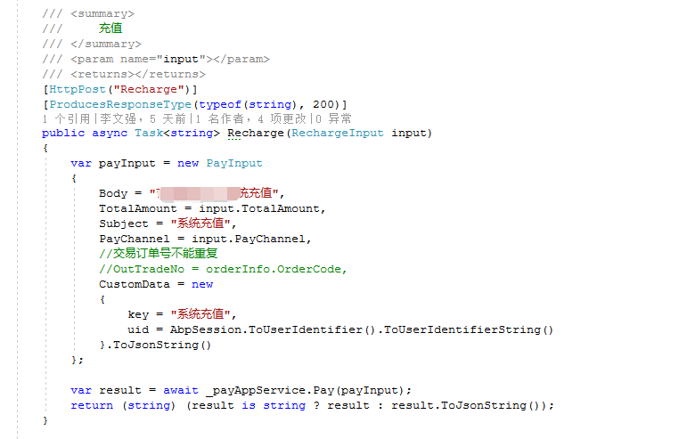
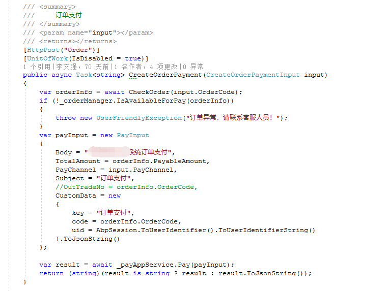
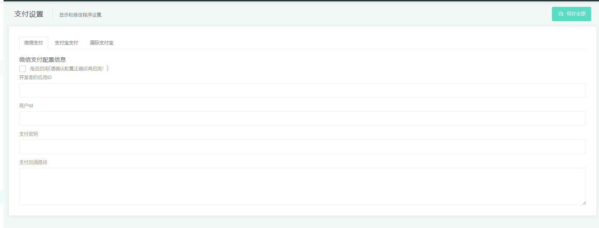
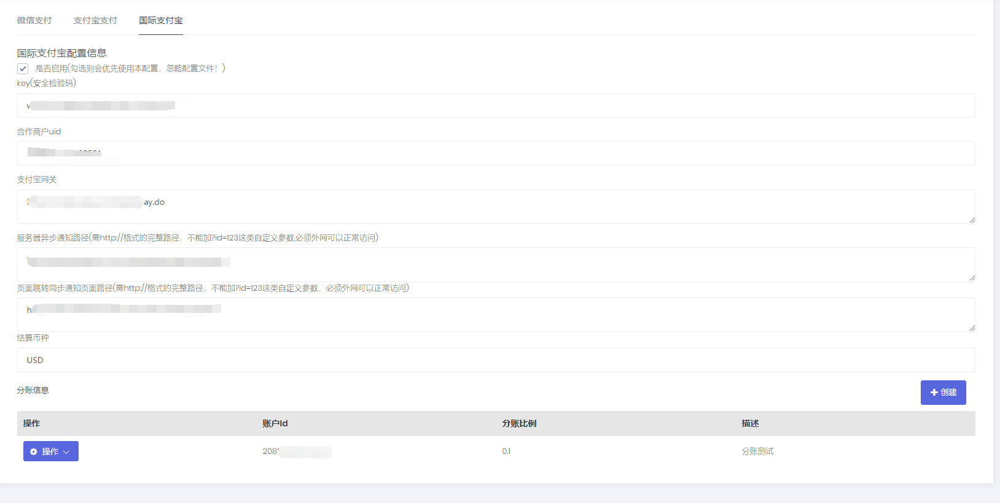
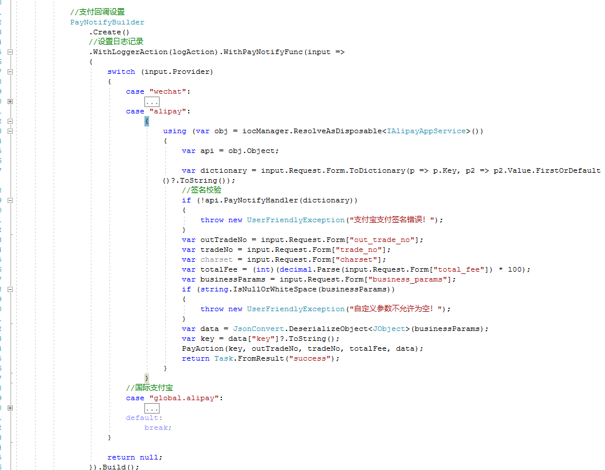

# Magicodes.Pay

## Nuget

| 名称     |      Nuget      | 
|----------|:-------------:|
| Magicodes.Alipay  |   |
| Magicodes.Alipay.Global |       |
| Magicodes.Pay.WeChat |  |
| Magicodes.PayNotify |  |

## 主要功能
Magicodes.Pay，是心莱科技团队提供的统一支付库，相关库均使用.NET标准库编写，支持.NET Framework以及.NET Core。目前支持以下支付方式和功能：
* 支付宝APP支付
* 支付宝Wap支付
* 支付宝国际支付
  * 支持分账
* 微信小程序支付
* 微信APP支付
* 统一支付回调处理
* 支持日志函数注入（不依赖支付库）
* 支持支付配置函数注入，以便于支持自定义配置获取逻辑，以应用于不同的场景（比如从配置文件、用户设置获取配置，或者多租户支持）

目前此库我们在很多项目上已经进行了验证，由于项目赶工，许多功能我们并没有添加、迁移或者重构过来，在后续的过程中，我们会逐步来完成这些工作。同时，在Magicodes.Admin开源库中，我们也编写了相关的Demo和实现。

Magicodes.Admin开源库地址：https://gitee.com/xl_wenqiang/Magicodes.Admin.Core

整个支付实现这块，我们在Magicodes.Admin开源库中已经提供了统一支付的Demo，而且我们将会提供根据请求头来自动调用相关支付的功能。如下图所示：

在各个业务支付场景中，我们可以非常方便的调用此统一支付，如下图所示：

## VNext

这是目前的下个版本的规划：

* 支付宝PC支付
* 微信H5支付
* 提供默认的回调管理逻辑，支持回调处理函数的注入

具体功能我们会根据项目的情况来迭代，如果你有好的建议或者意见，可以关注我们的公众号“magiccodes”来提交您的意见或者意见。

## 如何配置

相关库的配置相对比较简单，一般均使用相关Builder类来配置自定义日志逻辑、配置获取逻辑等，具体可以查阅Builder目录下的代码。

### 配置参考

相关配置请参考此代码:https://gitee.com/xl_wenqiang/Magicodes.Admin.Core/blob/develop/src/unity/Magicodes.Pay/Startup/PayStartup.cs

部分代码如下所示：

支付相关代码可以参考:
https://gitee.com/xl_wenqiang/Magicodes.Admin.Core/blob/develop/src/unity/Magicodes.Pay/Services/PayAppService.cs

### 配置界面参考

如下图所示:

## Demo

### 微信支付Demo

            if (WeChatPayApi == null)
            {
                throw new UserFriendlyException("支付未开放，请联系管理员！");
            }
            var appPayInput = new WeChat.Pay.Dto.AppPayInput
            {
                Body = input.Body,
                OutTradeNo = input.OutTradeNo,
                Attach = input.CustomData,
                TotalFee = input.TotalAmount,
                SpbillCreateIp = _clientInfoProvider?.ClientIpAddress
            };
            try
            {
                var appPayOutput = WeChatPayApi.AppPay(appPayInput);
                return Task.FromResult(appPayOutput);
            }
            catch (Exception ex)
            {
                throw new UserFriendlyException(ex.Message);
            }

### 支付宝支付Demo

            if (AlipayAppService == null)
            {
                throw new UserFriendlyException("支付未开放，请联系管理员！");
            }
            var appPayInput = new Alipay.Dto.AppPayInput
            {
                Body = input.Body,
                Subject = input.Subject,
                TradeNo = input.OutTradeNo,
                PassbackParams = input.CustomData,
                TotalAmount = input.TotalAmount
            };
            try
            {
                var appPayOutput = await AlipayAppService.AppPay(appPayInput);
                return appPayOutput.Response.Body;
            }
            catch (Exception ex)
            {
                throw new UserFriendlyException(ex.Message);
            }

### 支付宝国际支付Demo

            if (GlobalAlipayAppService == null)
            {
                throw new UserFriendlyException("支付未开放，请联系管理员！");
            }
            var payInput = new Alipay.Global.Dto.PayInput
            {
                Body = input.Body,
                Subject = input.Subject,
                TradeNo = input.OutTradeNo,
                //PassbackParams = input.CustomData,
                TotalFee = input.TotalAmount,
            };
            try
            {
                return await GlobalAlipayAppService.Pay(payInput);
            }
            catch (Exception ex)
            {
                throw new UserFriendlyException(ex.Message);
            }

### 国际支付宝分账参考界面

## 支付回调

### 目的

统一回调处理逻辑和回调处理地址

### 代码参考

上图的PayAction参考：

            void PayAction(string key, string outTradeNo, string transactionId, int totalFee, JObject data)
            {
                using (var paymentCallbackManagerObj = iocManager.ResolveAsDisposable<PaymentCallbackManager>())
                {
                    var paymentCallbackManager = paymentCallbackManagerObj?.Object;
                    if (paymentCallbackManager == null)
                    {
                        throw new ApplicationException("支付回调管理器异常，无法执行回调！");
                    }
                    AsyncHelper.RunSync(async () => await paymentCallbackManager.ExecuteCallback(key, outTradeNo, transactionId, totalFee, data));
                }
            }

完整回调代码请参考此代码:https://gitee.com/xl_wenqiang/Magicodes.Admin.Core/blob/develop/src/unity/Magicodes.Pay/Startup/PayStartup.cs

回调逻辑参考:

## 官方订阅号

关注“magiccodes”订阅号免费获取：

* 最新文章、教程、文档
* 视频教程
* 基础版免费授权
* 模板
* 解决方案
* 编程心得和理念

## 相关QQ群

编程交流群<85318032>

产品交流群<897857351>

## 官方博客

<http://www.cnblogs.com/codelove/>

## 其他开源库地址

<https://gitee.com/xl_wenqiang/Magicodes.Admin.Core>
<https://github.com/xin-lai>

